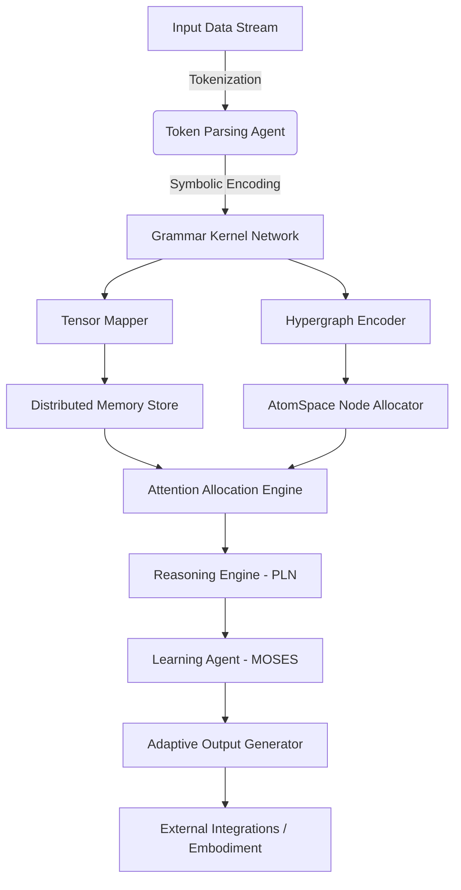

# Orchestral Architect: Distributed Agentic Cognitive Grammar

## Overview

The **Orchestral Architect** transforms the OzCog/cogutil repository into a modular, distributed system where each component is an "Agentic Grammar Kernel"—an intelligent agent that processes, transforms, and routes cognitive representations (tensors, symbols, hypergraphs) within a dynamic, extensible network.

This implementation provides a **neural-symbolic integration platform** that seamlessly bridges traditional symbolic AI (trees, logical structures) with modern tensor-based machine learning (GGML operations), all coordinated through an economic attention allocation system inspired by ECAN.

## System Architecture



## Core Components

### 1. Agentic Grammar Kernel (`AgenticKernel`)

The base class for all processing nodes in the network:

```cpp
class AgenticKernel {
public:
    // Core processing interface
    virtual ProcessingResult process(const CognitiveData& input) = 0;
    
    // Attention allocation interface
    virtual float estimate_processing_cost(const CognitiveData& input) const = 0;
    virtual float estimate_output_value(const CognitiveData& input) const = 0;
    virtual bool should_process(const CognitiveData& input, float available_attention) const;
    
    // Network communication interface
    virtual void register_callback(const std::string& event_type, 
                                   std::function<void(const CognitiveData&)> callback);
    virtual void emit_event(const std::string& event_type, const CognitiveData& data);
    
    // Learning and adaptation interface
    virtual void update_from_feedback(const ProcessingResult& result, float actual_value);
    virtual void adapt_parameters(const std::map<std::string, float>& performance_metrics);
};
```

### 2. Token Parsing Agent (`TokenParsingAgent`)

Converts raw input into structured symbolic representations:

```cpp
// Create different types of parsers
auto simple_parser = TokenParsingAgentFactory::create_simple_parser("parser_001");
auto grammar_parser = TokenParsingAgentFactory::create_grammar_parser("parser_002", grammar_rules);
auto hybrid_parser = TokenParsingAgentFactory::create_hybrid_parser("parser_003");

// Process input
CognitiveData input;
input.metadata["raw_text"] = "(thinking (about (cognitive (networks))))";
ProcessingResult result = parser->process(input);
```

### 3. Attention Allocation Engine (`AttentionAllocationEngine`)

ECAN-inspired economic resource management:

```cpp
AttentionAllocationEngine attention_engine;

// Request attention for processing
AttentionRequest request("kernel_id", cognitive_data, 50.0f);
bool allocated = attention_engine.request_attention(request);

// Release attention after processing
attention_engine.release_attention("kernel_id", "request_id", actual_cost, actual_value);
```

### 4. Kernel Registry (`KernelRegistry`)

Network-wide kernel management and communication:

```cpp
KernelRegistry& registry = KernelRegistry::instance();

// Register kernels
registry.register_kernel(token_parser);
registry.register_kernel(grammar_analyzer);

// Route data between kernels
registry.route_data(cognitive_data, "target_kernel_id");

// Get kernels by type
auto parsers = registry.get_kernels_by_type("token_parser");
```

### 5. Cognitive Data Structure (`CognitiveData`)

Unified representation for all data flowing through the network:

```cpp
struct CognitiveData {
    tree<std::string> symbolic_tree;          // Symbolic representation
    ggml_tensor* tensor_data;                  // Tensor representation
    std::map<std::string, float> attention_weights;  // Attention allocation
    std::map<std::string, std::string> metadata;     // Additional information
    std::string data_id;                       // Unique identifier
};
```

## Building and Installation

### Prerequisites

- C++17 compatible compiler
- CMake 3.12+
- Boost libraries (filesystem, program_options, system, thread)
- GGML (optional, for tensor operations)

### Build Instructions

```bash
# Clone repository
git clone https://github.com/OzCog/cogutil.git
cd cogutil

# Create build directory
mkdir build
cd build

# Configure and build
cmake ..
make -j4

# Install
sudo make install
```

### Building Examples

```bash
# Build manually (temporary solution)
cd cogutil
g++ -std=c++17 -I. -I./build/opencog/agentic/kernel -I./build/opencog/agentic/grammar \
    examples/agentic/basic_demo.cc \
    -L./build/opencog/util -L./build/opencog/agentic/kernel -L./build/opencog/agentic/grammar \
    -lcogutil -lagentic-kernel -lagentic-grammar \
    -lboost_system -lboost_filesystem \
    -o basic_demo

# Run demo
LD_LIBRARY_PATH=./build/opencog/util:./build/opencog/agentic/kernel:./build/opencog/agentic/grammar \
    ./basic_demo
```

## Usage Examples

### Basic Token Processing

```cpp
#include <opencog/agentic/grammar/TokenParsingAgent.h>

// Create parser
auto parser = TokenParsingAgentFactory::create_simple_parser("my_parser");

// Create input data
CognitiveData input;
input.data_id = "example_001";
input.metadata["raw_text"] = "hello world this is a test";

// Process
ProcessingResult result = parser->process(input);

// Access results
std::cout << "Tokens: " << result.output_data.metadata["token_count"] << std::endl;
std::cout << "Tree: " << result.output_data.symbolic_tree << std::endl;
```

### Advanced Grammar Processing

```cpp
// Create grammar-aware parser
std::vector<std::string> grammar_rules = {"(", ")", "func", "arg"};
auto grammar_parser = TokenParsingAgentFactory::create_grammar_parser("grammar_parser", grammar_rules);

// Process structured input
CognitiveData structured_input;
structured_input.metadata["raw_text"] = "(function (nested (deep structure)) argument)";
auto result = grammar_parser->process(structured_input);

// The parser preserves structural relationships
```

### Network Communication

```cpp
// Set up event-driven communication
parser->register_callback("token_parsed", [](const CognitiveData& data) {
    std::cout << "Received parsed tokens: " << data.data_id << std::endl;
});

// Emit events to other kernels
parser->emit_event("processing_complete", result.output_data);
```

### Attention-Aware Processing

```cpp
// Check if kernel should process based on attention availability
float available_attention = 100.0f;
if (kernel->should_process(input_data, available_attention)) {
    auto result = kernel->process(input_data);
    // Process result...
}
```

## Architecture Features

### Neural-Symbolic Integration

The system seamlessly bridges symbolic and tensor representations:

```cpp
// Convert between symbolic trees and tensors
tree<std::string> symbolic_data = /* ... */;
ggml_tensor* tensor_repr = kernel->create_tensor_from_tree(symbolic_data, context);

// Process with GGML operations
// ... tensor operations ...

// Convert back to symbolic
tree<std::string> result_tree = kernel->extract_tree_from_tensor(processed_tensor);
```

### Economic Attention Allocation

Resources are allocated based on economic principles:

- **Cost Estimation**: Each kernel estimates processing costs
- **Value Estimation**: Expected output value is calculated
- **Priority Scoring**: Cost/value ratio determines priority
- **Market Dynamics**: Attention prices adjust based on supply/demand
- **Performance Feedback**: Allocation strategies adapt based on results

### Event-Driven Communication

Kernels communicate asynchronously through events:

```cpp
// Register for events
kernel->register_callback("data_ready", [](const CognitiveData& data) {
    // Handle incoming data
});

// Emit events
kernel->emit_event("processing_complete", output_data);
```

### Adaptive Learning

Kernels adapt their behavior based on performance feedback:

```cpp
// Update based on actual performance
kernel->update_from_feedback(result, actual_value);

// Adapt parameters based on metrics
std::map<std::string, float> metrics;
metrics["efficiency"] = 0.85f;
metrics["accuracy"] = 0.92f;
kernel->adapt_parameters(metrics);
```

## Testing

Run the unit tests to verify functionality:

```bash
# Build tests (if CxxTest is available)
make test

# Or run specific agentic tests
# Note: Tests are located in tests/agentic/AgenticKernelUTest.cxxtest
```

## Performance Characteristics

### Scalability

- **Distributed**: Each kernel can run on separate processes/machines
- **Asynchronous**: Non-blocking communication between kernels
- **Parallel**: Multiple kernels can process different data simultaneously
- **Efficient**: C++ implementation with minimal overhead

### Memory Management

- **RAII**: Automatic resource cleanup for C++ objects
- **GGML Integration**: Efficient tensor memory management
- **Attention-Aware**: Memory allocation based on importance

### Latency

- **Low Overhead**: Direct function calls for local processing
- **Event-Driven**: Minimal latency for kernel communication
- **Optimized**: Efficient tree and tensor operations

## Extension Points

### Adding New Kernel Types

```cpp
class MyCustomKernel : public AgenticKernel {
public:
    MyCustomKernel(const KernelConfig& config) : AgenticKernel(config) {}
    
    ProcessingResult process(const CognitiveData& input) override {
        // Custom processing logic
        return result;
    }
    
    float estimate_processing_cost(const CognitiveData& input) const override {
        // Cost estimation logic
        return cost;
    }
    
    float estimate_output_value(const CognitiveData& input) const override {
        // Value estimation logic  
        return value;
    }
};
```

### Custom Attention Strategies

```cpp
class CustomAttentionEngine : public AttentionAllocationEngine {
    // Override allocation strategies
    bool evaluate_request(const AttentionRequest& request) override {
        // Custom evaluation logic
        return should_allocate;
    }
};
```

### Integration with External Systems

```cpp
// REST API integration
kernel->register_callback("external_request", [](const CognitiveData& data) {
    // Handle external API calls
    make_rest_call(data);
});

// Database integration  
kernel->register_callback("store_result", [](const CognitiveData& data) {
    database.store(data);
});
```

## Future Development

### Planned Integrations

1. **AtomSpace**: Full integration with OpenCog's knowledge representation
2. **PLN**: Probabilistic Logic Networks for reasoning
3. **MOSES**: Program evolution and optimization
4. **ROS**: Robot Operating System integration
5. **WebAssembly**: Browser-based deployment

### Advanced Features

1. **Full ECAN**: Complete Economic Attention Networks implementation
2. **Quantum**: Quantum computing integration points
3. **Blockchain**: Distributed consensus mechanisms
4. **IoT**: Internet of Things device integration
5. **VR/AR**: Virtual and Augmented Reality interfaces

## Contributing

This system is designed for extensibility. Key areas for contribution:

1. **New Kernel Types**: Domain-specific processing kernels
2. **Attention Strategies**: Advanced resource allocation algorithms
3. **Integration Modules**: Connections to external systems
4. **Performance Optimization**: GGML tensor operations
5. **Testing**: Comprehensive test coverage expansion

## License

This project is licensed under the same terms as the original cogutil project (GNU Affero General Public License v3).

## Acknowledgments

This implementation builds upon:
- **OpenCog Framework**: Foundational cognitive architecture
- **GGML**: Efficient tensor operations
- **ECAN**: Economic Attention Networks theory
- **Tree.h**: High-performance tree data structures

---

**The Orchestral Architect represents a new paradigm in cognitive computing—where symbolic reasoning and neural processing unite in a distributed, adaptive, and economically-efficient cognitive architecture.**