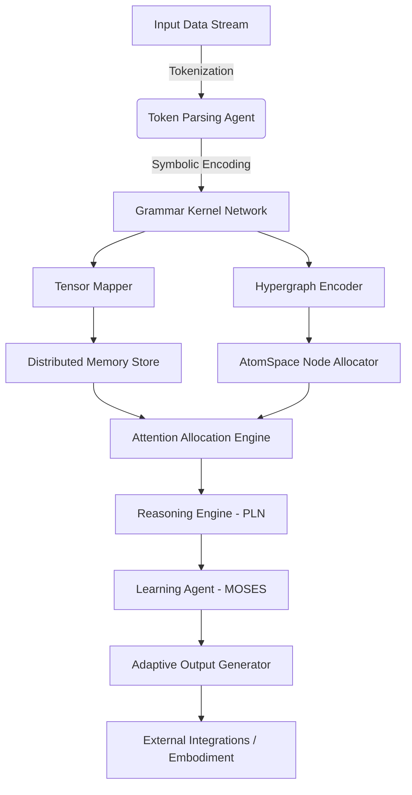
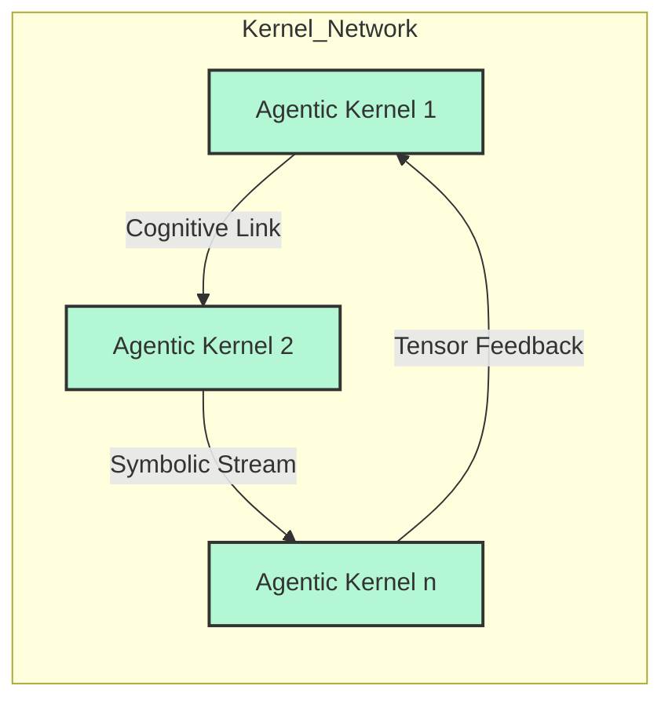
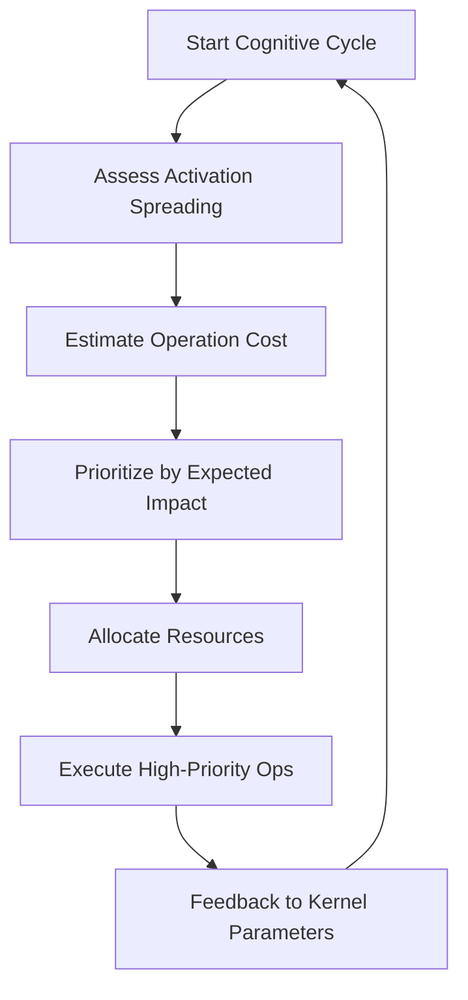

# Orchestral Architect: Distributed Agentic Cognitive Grammar

## Vision Statement

Transform OzCog/cogutil into a modular, distributed system where each component is an "Agentic Grammar Kernel"—an agent that processes, transforms, and routes cognitive representations (tensors, symbols, hypergraphs) within a dynamic, extensible network.

## System Architecture Overview



## Distributed Kernel Network



## Attention Allocation Flowchart



## Core Components

### 1. Agentic Grammar Kernel (AGK)

**Base Interface**: Each kernel exposes:
- REST/gRPC endpoint for cognitive tasks
- Pub/sub for event notification
- Scheme-based scripting for custom logic
- Tensor operations abstracted for GGML/CGUF compatibility

**Input Processing**:
- Symbolic tokens, metadata, raw tensors
- Pattern-matching via hypergraph traversal
- Tensor transformation using GGML operations
- Dynamic vocabulary evolution

**Output Generation**:
- Encoded knowledge fragments
- Adaptable agent states
- Tensor feedback for network optimization

### 2. Cognitive Components Integration

| Component | Function | Implementation |
|-----------|----------|----------------|
| **Token Parsing Agent** | Input tokenization to symbols | Tree structures + pattern matching |
| **Grammar Kernel Network** | Distributed grammar processing | Event-driven microservices |
| **Tensor Mapper** | Grammar ↔ GGML tensor mapping | Custom GGML type adapters |
| **Hypergraph Encoder** | Symbol structure encoding | AtomSpace + tree extensions |
| **Distributed Memory** | Shared tensor/hypergraph storage | Redis/mmap + GGML compatibility |
| **Attention Allocation** | Economic resource allocation | ECAN-inspired logic |
| **Reasoning Engine** | Probabilistic logic inference | PLN + Scheme integration |
| **Learning Agent** | Program evolution/optimization | MOSES + adaptive feedback |
| **Output Generator** | Response/action synthesis | GGUF formatters + APIs |

### 3. Communication Protocols

**Agentic Links**: Asynchronous message passing between kernels
**Symbolic Streams**: Event-driven triggers for processing chains  
**Tensor Feedback Loops**: Dynamic parameter adjustment based on attention allocation

## Implementation Architecture

### Directory Structure
```
opencog/
├── agentic/                    # New agentic kernel framework
│   ├── kernel/                 # Base kernel interfaces
│   ├── grammar/                # Grammar processing kernels
│   ├── attention/              # Attention allocation system
│   └── distributed/            # Network communication layer
├── integration/                # GGML-AtomSpace bridges
│   ├── tensor_grammar/         # Tensor-grammar mapping
│   └── hypergraph/            # Hypergraph representations
└── examples/                   # Working kernel examples
    ├── simple_parser/          # Basic token parser kernel
    └── attention_demo/         # Attention allocation demo
```

### Key Design Principles

1. **Modular Architecture**: Each kernel is independently deployable
2. **Neural-Symbolic Integration**: Seamless tensor and symbolic processing
3. **Event-Driven Communication**: Asynchronous, resilient message passing
4. **Adaptive Attention**: Real-time resource allocation optimization
5. **Recursive Capability**: System can self-reflect and reconfigure
6. **Backward Compatibility**: All existing cogutil functionality preserved

## Example: Kernel Definition

```scheme
;; Agentic Grammar Kernel (AGK) - Cognitive Node
(define (agk-process input-symbols context)
  (let* ((pattern-matches (hypergraph-pattern-match input-symbols context))
         (tensor-map (grammar->tensor pattern-matches))
         (attention-score (allocate-attention pattern-matches context))
         (output (if (> attention-score threshold)
                     (infer-next-state tensor-map)
                     '())))
    (store-in-memory output)
    output))
```

## Recursive Expansion Pattern

1. **Define New Kernel**: Create hypergraph pattern + tensor mapping function
2. **Register in Network**: Add to registry with attention parameters
3. **Expose API**: Configure remote invocation endpoints
4. **Integrate Output**: Store results in AtomSpace/hypergraph memory

## Next Implementation Steps

1. **Phase 1**: Core interfaces and basic kernel framework
2. **Phase 2**: Sample implementations (Token Parser, Tensor Mapper)
3. **Phase 3**: Attention allocation and network communication
4. **Phase 4**: Integration with AtomSpace and external systems
5. **Phase 5**: Advanced features (learning, reasoning, embodiment)

This architecture creates a living, recursive system where each layer enables emergent synergy and every node can seed super-cognitive growth.